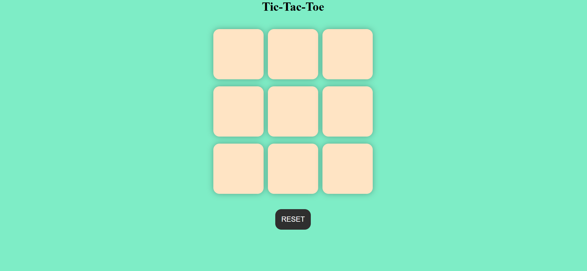

# ❌⭕ Tic-Tac-Toe Game

A fun and interactive **Tic-Tac-Toe** game built using **HTML, CSS, and JavaScript**. This project allows two players to play the classic Tic-Tac-Toe game in the browser with a clean and responsive user interface.

## 🚀 Features

* Two-player gameplay (X vs O)
* Winner detection logic
* Draw game detection
* Reset/New Game functionality
* Responsive and user-friendly design
* Interactive game board

## 🛠️ Technologies Used

* **HTML5** – Structure of the application
* **CSS3** – Styling and layout
* **JavaScript (ES6)** – Game logic and interactivity

## 📂 Project Structure

```text
Tic-Tac-Toe/
│
├── index.html
├── style.css
├── script.js
└── README.md
```

## 🎯 How to Play

1. Open the game in your web browser.
2. Player **X** starts the game.
3. Players take turns clicking on empty cells.
4. The first player to align three symbols horizontally, vertically, or diagonally wins.
5. If all cells are filled and no player wins, the game ends in a draw.
6. Click the **Reset** or **New Game** button to play again.

## ⚙️ Installation

1. Clone the repository:

```bash
git clone https://github.com/your-username/Tic-Tac-Toe.git
```

2. Navigate to the project directory:

```bash
cd Tic-Tac-Toe
```

3. Open `index.html` in your browser.

## 📸 Screenshot

Add a screenshot of your project here:

```markdown

```

## 🔮 Future Enhancements

* Single-player mode with AI
* Difficulty levels (Easy, Medium, Hard)
* Scoreboard tracking
* Sound effects and animations
* Online multiplayer support

## 🤝 Contributing

Contributions are welcome! Feel free to fork the repository and submit a pull request.

## 📄 License

This project is open source and available under the MIT License.

## 👨‍💻 Author

**Pratyush Kumar Mishra**

Built with ❤️ using HTML, CSS, and JavaScript.
